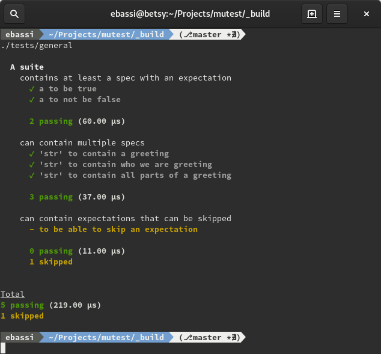

## µTest - A small C testing library

 - **Linux**: [](https://travis-ci.org/ebassi/mutest)
 - **Windows**: [](https://ci.appveyor.com/project/ebassi/mutest/branch/master)

µTest aims to be a small unit testing library for C projects, with an API
heavily modelled on high level frameworks like Jasmine or Mocha.

**WARNING**: µTest's API is still in flux until I mark the first release.

## Building µTest

Simply clone this repository, and use [Meson](http://mesonbuild.com) to
generate the appropriate build instructions:

```sh
$ git clone https://github.com/ebassi/mutest.git
$ cd mutest
$ meson _build .
$ cd _build
$ ninja
$ meson test
$ sudo ninja install
```

## Using µTest

### Adding µTest to your project

µTest provides a shared library and a [pkg-config](https://www.freedesktop.org/wiki/Software/pkg-config/)
file to describe the necessary compiler and linker flags. If you are
using Meson:

```meson
mutest_dep = dependency('mutest-1')
```

And if you're using Autotools:

```m4
PKG_CHECK_MODULES(MUTEST, [mutest-1])
AC_SUBST(MUTEST_CFLAGS)
AC_SUBST(MUTEST_LIBS)
```

You can also depend on µTest as a subproject in existing Meson-based
projects through a wrap file and a Git sub-module:

```sh
$ cat >subprojects/mutest.wrap <<HERE
> [wrap-git]
> directory=mutest
> url=https://github.com/ebassi/mutest.git
> revision=master
> HERE
```

And using the `fallback` option in your Meson build:

```meson
mutest_dep = dependency('mutest-1',
  fallback: [ 'mutest', 'mutest_dep' ],
  default_options: ['static=true'],
  required: false,
  disabler: true,
)
```

The sub-project route is strongly encouraged.

Once you added the dependency, use:

```cpp
#include <mutest.h>
```

In your test sources to use the µTest API.

### Getting started

The µTest API is heavily influenced by frameworks such as [Mocha][mocha]
and [Jasmine][jasmine].

[mocha]: https://mochajs.org/
[jasmine]: https://jasmine.github.io/

You start from a *suite*, by calling `mutest_describe()` with a string
containing the description of the suite, and a function pointer:

```cpp
MUTEST_MAIN (
  mutest_describe ("General", general_suite);
)
```

Inside each suite you define a *spec*, by calling `mutest_it()`, with a
string containing the description of the spec, and a function pointer:

```cpp
static void
general_suite (mutest_suite_t *suite)
{
  mutest_it ("contains at least a spec with an expectation", general_spec);
  mutest_it ("can contain multiple specs", another_spec);
  mutest_it ("should be skipped", skip_spec);
}
```

Each spec contains *expectations*, one for each condition that needs to be
satisfied:

```cpp
static void
general_spec (mutest_spec_t *spec)
{
  bool a = true;

  mutest_expect ("a is true",
                 mutest_bool_value (a),
                 mutest_to_be, true,
                 NULL);
  mutest_expect ("a is not false",
                 mutest_bool_value (a),
                 mutest_not, mutest_to_be, false,
                 NULL);
}
```

Expectations match the expected type and value of a variable against the
some *expected* value specified in the test suite; some expectations can
be made of multiple conditions that need to be satisfied at the same time:

```cpp
static void
another_spec (mutest_spec_t *spec)
{
  const char *str = "hello, world";

  mutest_expect ("str contains 'hello'",
                 mutest_string_value (str),
                 mutest_to_contain_string, "hello",
                 NULL);
  mutest_expect ("str contains 'world'",
                 mutest_string_value (str),
                 mutest_to_contain_string, "world",
                 NULL);
  mutest_expect ("contains all fragments",
                 mutest_string_value (str),
                 mutest_to_start_with_string, "hello",
                 mutest_to_contain_string, ",",
                 mutest_to_end_with_string, "world",
                 NULL);
}
```

Some expectations can also be programmatically skipped:

```cpp
static void
skip_spec (mutest_spec_t *spec)
{
  mutest_expect ("skip this test",
                 mutest_bool_value (true),
                 mutest_skip,
                 NULL);
}
```

Building the test case and running it will generate the following result
with the default formatter:



If you have a [TAP](https://testanything.org/) harness already in place, you
should use the TAP formatted, by exporting the `MUTEST_OUTPUT=tap` variable
in your test environment:

```tap
MUTEST_OUTPUT=tap ./tests/general
# General
# contains at least a spec with an expectation
ok 1 - a is true
ok 2 - a is not false
# can contain multiple specs
ok 3 - str contains 'hello'
ok 4 - str contains 'world'
ok 5 - contains all fragments
# should be skipped
ok 6 - skip this test # SKIP
1..6
```

## License

µTest is released under the terms of the [MIT](./LICENSE.txt) license.
